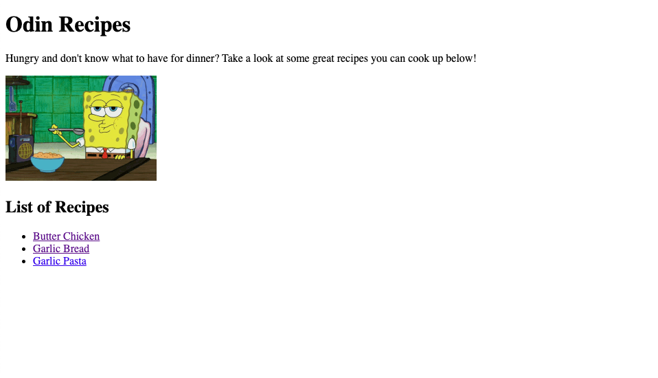
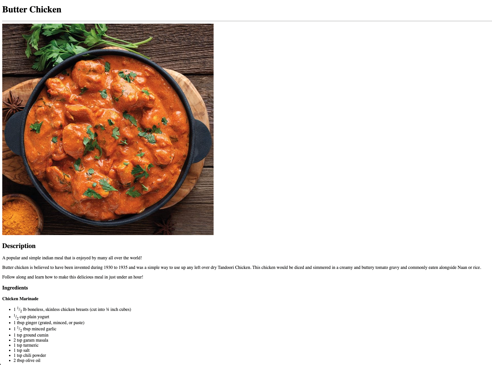

# Odin Recipes - My 1st HTML Project

## About

A simple website to practice the HTML fundamental skills gained from the Odin Project.

Visit the live page [here](https://rabeyrathna.github.io/odin-recipes/)!

## Skills applied in this project

    - HTML
    - Markdown
    - CSS (Not currently in use but will be implemented at a future date)

## Screenshots

### v1.0

#### Index Homepage

#### Butter Chicken Recipe Page

